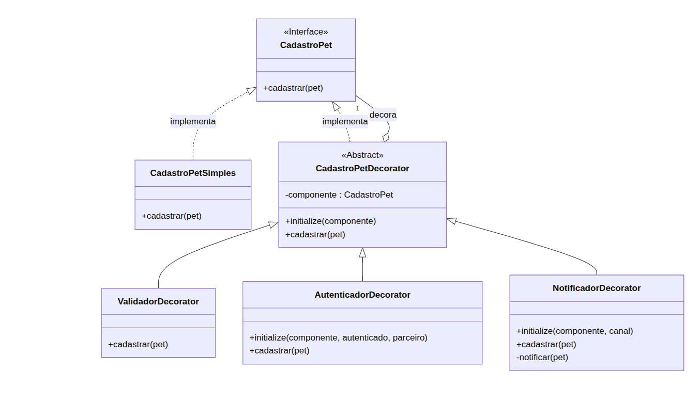
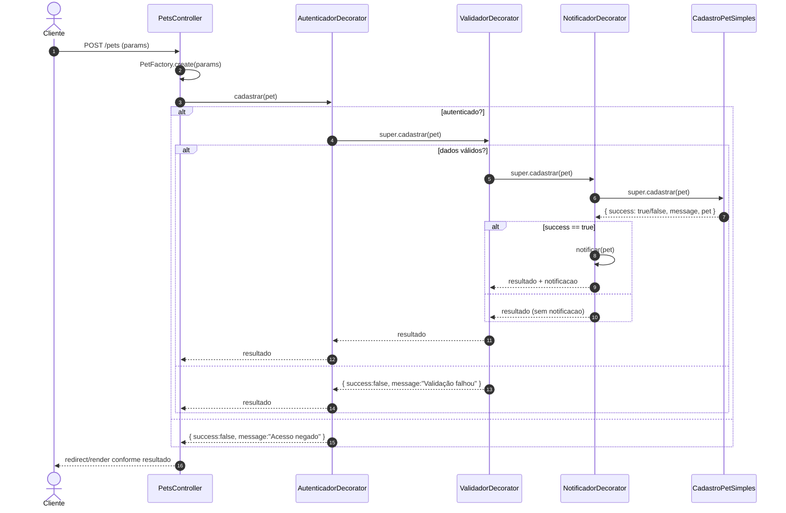
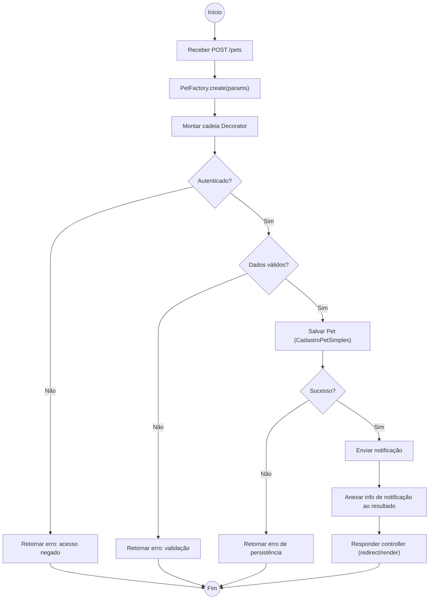

# 3.2 GoFs Estruturais – Padrão Decorator

## 1) Introdução

O padrão **Decorator**, pertencente ao grupo de padrões estruturais definidos pela Gang of Four (GoF), tem como objetivo adicionar responsabilidades adicionais a um objeto dinamicamente. Os decoradores fornecem uma alternativa flexível à herança para estender funcionalidades, envolvendo o objeto original em um novo objeto "decorador" que possui a mesma interface, mas adiciona o novo comportamento.

Neste contexto, o padrão foi aplicado com o objetivo de adicionar comportamentos dinamicamente aos componentes do sistema de cadastro de pets. A implementação permite que funcionalidades, como validações ou notificações de eventos, sejam "anexadas" aos objetos de pet sem modificar suas classes originais.

Essa abordagem promove um design mais flexível, reutilizável e aderente aos princípios SOLID, em especial o Open/Closed Principle (aberto para extensão, fechado para modificação), permitindo que o sistema evolua de forma coesa sem alterar o código-fonte existente dos componentes centrais.

---

## 2) Metodologia

A implementação foi organizada com base nos papéis definidos pelo padrão Decorator, resultando na seguinte estrutura:

1. **Componente (Interface)** — `cadastro_pet`: define o contrato que todos os componentes e decoradores devem seguir, contendo o método abstrato `cadastrar(pet)`.
2. **Componente Concreto** — `cadastro_pet_simples`: implementação básica do cadastro de pets, responsável por persistir o pet no banco de dados.
3. **Decorator Abstrato** — `cadastro_pet_decorator`: mantém uma referência a um objeto `cadastro_pet` e delega chamadas ao método `cadastrar(pet)`.
4. **Decoradores Concretos** — adicionam funcionalidades específicas:
   - `autenticador_decorator`: verifica permissões antes do cadastro.  
   - `validador_decorator`: valida os dados do pet.  
   - `notificador_decorator`: envia notificações após o cadastro.
  - `logger_decorator`: adiciona auditoria e logging ao processo.

Essa estrutura permite a **composição dinâmica** de funcionalidades. Assim, o mesmo objeto `cadastro_pet_simples` pode ser envolvido por vários decoradores, empilhando comportamentos de autenticação, validação e notificação sem alterar o código principal.

---

## 3) Tabela de Participação

| Integrante | Atividade Realizada | Artefato/Entrega |
| :--- | :--- | :--- |
| **Davi de Aguiar** | Elaboração do Diagrama de Classes UML do padrão Decorator | Diagrama de Classes (imagem \`Diagrama\_uml\_decorators.png\`) com hierarquia completa: \`CadastroPet\` → \`CadastroPetDecorator\` → Decoradores Concretos |
| **Wallyson Souza** | Elaboração do Diagrama de Sequência do fluxo de decorators | Diagrama de Sequência em Mermaid mostrando a cadeia \`Autenticador → Validador → Notificador → CadastroPetSimples\` |
| **Mateus de Castro** | Elaboração do Diagrama de Atividade do processo de cadastro | Diagrama de Atividade em Mermaid (flowchart) com todos os pontos de decisão do fluxo |
| **Davi de Aguiar** | Estruturação da arquitetura base do padrão Decorator | Criação do módulo \`CadastroPet\` (interface) e classe abstrata \`CadastroPetDecorator\` em \`app/services/\` e \`app/decorators/\` |
| **Wallyson Souza** | Implementação do \`AutenticadorDecorator\` | Arquivo \`app/decorators/autenticador\_decorator.rb\` com validação de autenticação e permissões do parceiro |
| **Davi de Aguiar** | Implementação do \`ValidadorDecorator\` | Arquivo \`app/decorators/validador\_decorator.rb\` com validações de campos obrigatórios e regras de negócio |
| **Mateus de Castro** | Implementação do \`NotificadorDecorator\` | Arquivo \`app/decorators/notificador\_decorator.rb\` com sistema de notificação multi-canal |
| **Wallyson Souza** | Testes de autenticação e integração | Validação de cenários autorizados/não autorizados e verificação de logs do sistema |
| **Mateus de Castro** | Testes de integração da cadeia completa de decorators | Validação do funcionamento completo da cadeia e envio de notificações em diferentes cenários |
| **Mateus de Castro** | Integração dos decorators com PetsController e PetFactory | Implementação do método \`cadastrar\_com\_decorators(pet)\` garantindo composição dinâmica |
| **Erick Santos** | Extensão do ValidadorDecorator com funcionalidade de exclusão | Implementação do método \`destroy(pet)\` no \`ValidadorDecorator\` e criação do serviço \`DeletePet\` para exclusão de pets com validação e logging |
| **Ian** | Extensão do Padrão Decorator com Auditoria | Implementação do \`LoggerDecorator\` (\`app/decorators/logger\_decorator.rb\`) e refatoração do \`PetsController#create\` para usar a cadeia de decoradores. |
| **José** | Teste e Validação do Fluxo Decorado | Teste e validação de cenários de sucesso e falha no \`PetsController\#create\` para garantir que o fluxo \`Logger → Autenticador → Validador\` está funcionando corretamente. |

---

## 4) Resultados

A adoção do padrão Decorator no **CuidaDeMim** proporcionou uma arquitetura **modular e expansível**, facilitando a adição de novas camadas de comportamento sem modificar o código existente.  
O sistema agora permite que operações de autenticação, validação e notificação sejam executadas de forma **encadeada**, mantendo a **separação de responsabilidades** entre as classes.

Isso garante maior facilidade de manutenção e evolução do sistema, já que novos decoradores podem ser adicionados com impacto mínimo no restante da aplicação.

---
## 5) Diagrama de Classes



---

## 6) Diagrama de Sequência — Fluxo no `PetsController#create`

Cadeia usada em `cadastrar_com_decorators(pet)` (ordem externa→interna):
`Autenticador → Validador → Notificador → CadastroPetSimples`.



---

## 7) Diagrama de Atividade — Processo de Cadastro



---
## 8) Descrição das Classes

### 8.1) CadastroPet (Componente)
Interface base que define o contrato que os componentes concretos e decoradores devem seguir, por meio do método `cadastrar(pet)`. Garante que todos os elementos do padrão compartilhem a mesma assinatura de comportamento.

---

### 8.2) CadastroPetSimples (Componente Concreto)
Implementa o módulo `CadastroPet`. Realiza o cadastro simples do pet no banco de dados, retornando um hash com o status e a mensagem do processo.

---

### 8.3) CadastroPetDecorator (Decorator Abstrato)
Mantém uma referência a um objeto que implementa `CadastroPet` e delega a execução do método `cadastrar(pet)`. Serve de base para todos os decoradores concretos do sistema.

---

### 8.4) ValidadorDecorator (Decorador Concreto)
Adiciona a funcionalidade de validação de dados do pet antes do cadastro, verificando se campos obrigatórios estão preenchidos e se as informações são válidas. Também inclui o método `destroy(pet)` para exclusão de pets com logging apropriado.

---

### 8.5) AutenticadorDecorator (Decorador Concreto)
Inclui a autenticação de usuário no processo de cadastro, garantindo que apenas usuários autorizados possam registrar novos pets.

---

### 8.6) NotificadorDecorator (Decorador Concreto)
Responsável por enviar notificações (por e-mail, SMS ou log) após o cadastro bem-sucedido do pet.

---

## 9) Código das Classes

### 9.1) `app/services/cadastro_pet.rb`
<details>
<summary>Ver código: app/services/cadastro_pet.rb</summary>

```ruby
# frozen_string_literal: true

# Interface base para o cadastro de pets (Componente do padrão Decorator)
# Define o contrato que todos os componentes concretos e decoradores devem seguir
module CadastroPet
  # Método principal que realiza o cadastro do pet
  # @param pet [Pet] O objeto pet a ser cadastrado
  # @return [Hash] Resultado do cadastro com status e mensagem
  def cadastrar(pet)
    raise NotImplementedError, "#{self.class} deve implementar o método 'cadastrar'"
  end
end
```
</details>

---

### 9.2) `app/services/cadastro_pet_simples.rb`
<details>
<summary>Ver código: app/services/cadastro_pet_simples.rb</summary>

```ruby
# frozen_string_literal: true

# Componente concreto que implementa o cadastro básico de pets
# Responsabilidade: Realizar o cadastro simples do pet no banco de dados
class CadastroPetSimples
  include CadastroPet

  # Realiza o cadastro simples do pet
  # @param pet [Pet] O objeto pet a ser cadastrado
  # @return [Hash] Resultado do cadastro com status e mensagem
  def cadastrar(pet)
    if pet.save
      {
        success: true,
        message: "Pet '#{pet.name}' cadastrado com sucesso!",
        pet: pet
      }
    else
      {
        success: false,
        message: "Erro ao cadastrar pet: #{pet.errors.full_messages.join(', ')}",
        pet: pet
      }
    end
  rescue StandardError => e
    {
      success: false,
      message: "Erro inesperado ao cadastrar pet: #{e.message}",
      pet: pet
    }
  end
end
```
</details>

---

### 9.3) `app/decorators/autenticador_decorator.rb`
<details>
<summary>Ver código: app/decorators/autenticador_decorator.rb</summary>

```ruby
# frozen_string_literal: true

# Decorador concreto que adiciona autenticação antes do cadastro
# Responsabilidade: Verificar se o parceiro está autenticado antes de permitir o cadastro
class AutenticadorDecorator < CadastroPetDecorator
  # @param componente [CadastroPet] O componente a ser decorado
  # @param autenticado [Boolean] Se o usuário está autenticado
  # @param parceiro [String, nil] Nome ou identificação do parceiro (opcional)
  def initialize(componente, autenticado:, parceiro: nil)
    super(componente)
    @autenticado = autenticado
    @parceiro = parceiro
  end

  # Adiciona comportamento de autenticação antes de cadastrar
  # @param pet [Pet] O objeto pet a ser cadastrado
  # @return [Hash] Resultado da autenticação e cadastro
  def cadastrar(pet)
    unless @autenticado
      mensagem = "Acesso negado! Parceiro não autenticado."
      mensagem += " Usuário: #{@parceiro}" if @parceiro
      
      Rails.logger.warn(mensagem)
      return {
        success: false,
        message: mensagem,
        pet: pet
      }
    end

    log_msg = "Parceiro autenticado"
    log_msg += " (#{@parceiro})" if @parceiro
    log_msg += " procedendo com o cadastro do pet '#{pet.name}'"
    Rails.logger.info(log_msg)

    # Se autenticado, delega para o próximo componente na cadeia
    super(pet)
  end
end

```
</details>

---

### 9.4) `app/decorators/cadastro_pet_decorator.rb`
<details>
<summary>Ver código: app/decorators/cadastro_pet_decorator.rb</summary>

```ruby
# frozen_string_literal: true

# Decorador base abstrato para cadastro de pets
# Implementa o padrão Decorator do GoF, mantendo referência ao componente decorado
# e delegando a chamada para ele
class CadastroPetDecorator
  include CadastroPet

  # @param componente [CadastroPet] O componente a ser decorado
  def initialize(componente)
    @componente = componente
  end

  # Delega a chamada para o componente decorado
  # @param pet [Pet] O objeto pet a ser cadastrado
  # @return [Hash] Resultado do cadastro
  def cadastrar(pet)
    @componente.cadastrar(pet)
  end
end


```

</details>

---

### 9.5) `app/decorators/notificador_decorator.rb`
<details>
<summary>Ver código: app/decorators/notificador_decorator.rb</summary>

```ruby
# frozen_string_literal: true

# Decorador concreto que adiciona notificação após o cadastro bem-sucedido
# Responsabilidade: Enviar notificações após o cadastro do pet
class NotificadorDecorator < CadastroPetDecorator
  # @param componente [CadastroPet] O componente a ser decorado
  # @param canal [String] Canal de notificação (email, sms, push, etc.)
  def initialize(componente, canal: 'email')
    super(componente)
    @canal = canal
  end

  # Adiciona comportamento de notificação após cadastrar
  # @param pet [Pet] O objeto pet a ser cadastrado
  # @return [Hash] Resultado do cadastro com informações de notificação
  def cadastrar(pet)
    # Primeiro executa o cadastro (delega para o componente decorado)
    resultado = super(pet)

    # Se o cadastro foi bem-sucedido, envia notificação
    if resultado[:success]
      notificar(pet)
      resultado[:notificacao] = {
        enviada: true,
        canal: @canal,
        mensagem: "Notificação enviada com sucesso via #{@canal}"
      }
    else
      Rails.logger.info("Cadastro falhou, notificação não será enviada")
    end

    resultado
  end

  private

  # Simula o envio de notificação
  # @param pet [Pet] O pet que foi cadastrado
  def notificar(pet)
    mensagem = <<~MSG
      ========================================
      📧 NOTIFICAÇÃO DE CADASTRO (via #{@canal.upcase})
      ========================================
      Pet: #{pet.name}
      Espécie: #{pet.species}
      Idade: #{pet.age} ano(s)
      Descrição: #{pet.description || 'Sem descrição'}
      
      O pet foi cadastrado com sucesso no sistema CuidaDeMim!
      Em breve estará disponível para adoção.
      ========================================
    MSG

    Rails.logger.info(mensagem)
    
    # Aqui você poderia integrar com serviços reais de notificação:
    # - ActionMailer para emails
    # - Twilio para SMS
    # - Firebase para push notifications
    # Por enquanto, apenas logamos a notificação
  end
end


```

</details>

---

### 9.6) `app/decorators/validador_decorator.rb`
<details>
<summary>Ver código: app/decorators/validador_decorator.rb</summary>

```ruby
# frozen_string_literal: true

# Decorador concreto que adiciona validação de dados antes do cadastro
# Responsabilidade: Verificar se os dados do pet são válidos antes de prosseguir
class ValidadorDecorator < CadastroPetDecorator
  # Adiciona comportamento de validação antes de cadastrar
  # @param pet [Pet] O objeto pet a ser cadastrado
  # @return [Hash] Resultado da validação e cadastro
  def cadastrar(pet)
    resultado_validacao = validar_pet(pet)

    unless resultado_validacao[:valido]
      Rails.logger.warn("Validação falhou: #{resultado_validacao[:erros].join(', ')}")
      return {
        success: false,
        message: "Validação falhou: #{resultado_validacao[:erros].join(', ')}",
        pet: pet
      }
    end

    Rails.logger.info("Validação bem-sucedida para pet '#{pet.name}'")
    # Se válido, delega para o próximo componente na cadeia
    super(pet)
  end

  private

  # Valida os dados do pet
  # @param pet [Pet] O pet a ser validado
  # @return [Hash] Resultado da validação com status e lista de erros
  def validar_pet(pet)
    erros = []

    if pet.name.blank?
      erros << "Nome do pet não pode estar vazio"
    end

    if pet.age.nil?
      erros << "Idade do pet deve ser informada"
    elsif pet.age.negative?
      erros << "Idade do pet deve ser um valor positivo"
    elsif pet.age > 30
      erros << "Idade do pet parece inválida (muito alta)"
    end

    if pet.species.blank?
      erros << "Espécie do pet não pode estar vazia"
    end

    {
      valido: erros.empty?,
      erros: erros
    }
  end

  # Adiciona comportamento de exclusão com validação
  # @param pet [Pet] O objeto pet a ser excluído
  # @return [Hash] Resultado da exclusão
  def destroy(pet)
    if pet.destroy
      Rails.logger.info("Pet '#{pet.name}' destruído com sucesso.")
      {
        success: true,
        message: "Pet foi deletado com sucesso",
        pet: pet
      }
    else
      Rails.logger.error("Falha ao deletar o pet '#{pet.name}': #{pet.errors.full_messages.join(', ')}")
      {
        success: false,
        message: "Falha ao deletar o pet.",
        pet: pet
      }
    end
  end
end

```
</details>

---

### 9.7) `app/services/delete_pet.rb`
<details>
<summary>Ver código: app/services/delete_pet.rb</summary>

```ruby
# frozen_string_literal: true

# Serviço para exclusão de pets do sistema
# Responsabilidade: Realizar a exclusão de um pet com tratamento de erros
class DeletePet
  # Realiza a exclusão de um pet do sistema
  # @param pet [Pet] O objeto pet a ser excluído
  # @return [Hash] Resultado da exclusão com status e mensagem
  def self.delete(pet)
    if pet.destroy
      Rails.logger.info("Pet '#{pet.name}' excluído com sucesso.")
      {
        success: true,
        message: "Pet '#{pet.name}' excluído com sucesso!",
        pet: pet
      }
    else
      Rails.logger.error("Erro ao excluir pet: #{pet.errors.full_messages.join(', ')}")
      {
        success: false,
        message: "Erro ao excluir pet: #{pet.errors.full_messages.join(', ')}",
        pet: pet
      }
    end
  rescue StandardError => e
    Rails.logger.error("Erro inesperado ao excluir pet: #{e.message}")
    {
      success: false,
      message: "Erro inesperado ao excluir pet: #{e.message}",
      pet: pet
    }
  end
end
```
<center>
  Autor: Erick Santos
</center>
</details>

### 9.8) `app/services/logger_decorator.rb`

<details>
<summary>Ver código: app/services/logger_decorator.rb</summary>

```ruby
require_relative 'cadastro_pet_decorator'

class LoggerDecorator < CadastroPetDecorator
  
  # Sobrescreve o método principal (cadastrar)
  def cadastrar(pet)
    # 1. LOG: Registra a tentativa de cadastro ANTES de delegar
    log_message = "AUDITORIA: Tentativa de cadastro do Pet #{pet.nome} pelo usuário #{pet.user_id || 'Desconhecido'}."
    Rails.logger.info(log_message)
    
    # 2. DELEGAÇÃO: Chama o próximo componente/decorador na cadeia
    resultado = super(pet)
    
    # 3. LOG: Registra o resultado APÓS a delegação
    if resultado[:success]
      Rails.logger.info("AUDITORIA: Cadastro de Pet #{pet.nome} realizado com SUCESSO. ID: #{resultado[:pet].id}")
    else
      Rails.logger.error("AUDITORIA: Falha no cadastro do Pet #{pet.nome}. Motivo: #{resultado[:message]}")
    end

    # 4. RETORNO: Retorna o resultado inalterado
    resultado
  end
end
```
<center>
  Autor: Ian e José
</center>
</details>
---

## 10) Conclusão

O uso do padrão Decorator neste módulo do sistema CuidaDeMim mostrou-se eficaz para estender funcionalidades de forma flexível e independente.
Cada responsabilidade — validação, autenticação e notificação — foi isolada em decoradores distintos, mantendo o código limpo, reutilizável e facilmente escalável.

Essa abordagem promove aderência aos princípios SOLID, melhora a manutenibilidade do sistema e possibilita futuras extensões sem alterar a lógica principal de cadastro de pets.

---
## 11) Referências
Gamma, E., Helm, R., Johnson, R., & Vlissides, J. Design Patterns: Elements of Reusable Object-Oriented Software. Addison-Wesley, 1994.

Documentation Ruby on Rails – https://guides.rubyonrails.org/

Refactoring Guru – Decorator Pattern: https://refactoring.guru/design-patterns/decorator

---

## 12) Histórico de Versões

| Versão | Data | Descrição | Autores | Revisor |
| :--- | :--- | :--- | :--- | :--- |
| 1.0 | 22/10/2025 | Criação inicial do documento com diagrama de classes, sequência e atividade | Davi de Aguiar, Wallyson Souza, Mateus de Castro | - |
| 1.1 | 23/10/2025 | Implementação dos decoradores concretos (Autenticador, Validador, Notificador) | Davi de Aguiar, Wallyson Souza, Mateus de Castro | - |
| 1.2 | 24/10/2025 | Extensão do ValidadorDecorator com funcionalidade de exclusão e criação do serviço DeletePet | Erick Santos | - |
| **1.3** | **24/10/2025** | **Adição do LoggerDecorator (Auditoria) e refatoração do PetsController\#create para integrar o fluxo completo de decoradores.** | **Ian e José** | - |

---

## 13) Gravação da Reunião

<iframe src="https://unbbr.sharepoint.com/sites/Arquitetura_cjwkul/_layouts/15/embed.aspx?UniqueId=bbbc9083-09d0-403e-8eae-e07eb7630089&embed=%7B%22ust%22%3Atrue%2C%22hv%22%3A%22CopyEmbedCode%22%7D&referrer=StreamWebApp&referrerScenario=EmbedDialog.Create" width="640" height="360" frameborder="0" scrolling="no" allowfullscreen title="Reunião em General-20251024_170613-Gravação de Reunião.mp4"></iframe>


