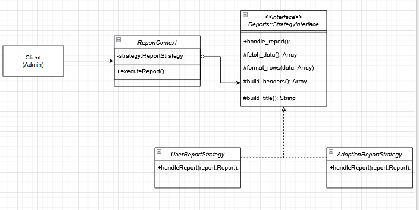

# *Strategy Pattern*

## **Introdução**

O **padrão Strategy**, pertencente ao grupo de padrões comportamentais definidos pela **Gang of Four (GoF)**, tem como objetivo **definir uma família de algoritmos, encapsular cada um deles e torná-los intercambiáveis**. Isso permite que o algoritmo varie independentemente dos clientes que o utilizam, promovendo **baixo acoplamento** e a **extensibilidade** do sistema.

Neste contexto, o diagrama de classes representa a aplicação desse padrão em um módulo de geração de relatórios. Ele descreve como o **controller** (cliente) delega a execução do relatório a um **Contexto** (`ReportContext`), que por sua vez utiliza a **Estratégia** (`StrategyInterface`) correta para realizar a operação.

Esse modelo proporciona uma arquitetura flexível, permitindo adicionar novos tipos de relatórios (ex: `FinancialReportStrategy`) sem alterar o código do controller, apenas criando uma nova classe de estratégia concreta.

---

## **Metodologia**

AA modelagem foi desenvolvida com base na implementação do **Strategy Pattern** aplicada ao `Admin::ReportsController` de um sistema Ruby on Rails. O trabalho foi realizado de forma colaborativa pelos integrantes do grupo, utilizando a ferramenta **Draw.io** para a elaboração do diagrama UML.

A metodologia seguiu os seguintes passos:
1. Identificação das classes envolvidas no padrão (Cliente, Contexto, Estratégia e Estratégias Concretas);
2. Definição dos atributos e métodos relevantes de cada classe;
3. Representação dos relacionamentos (associação, implementação e dependência);
4. Validação do diagrama em grupo para garantir a coerência conceitual e sintática.
5. Implementação prática no código com interface básica.

A escolha do **Draw.io** se deu por sua conformidade com a notação UML e pela facilidade de colaboração visual.
A escolha do Ruby on Rails se deu pela facilidade dos membros de trabalharem com a tecnologia e possibilidade de aplicação dos GOFs no framework.

---

## **Tabela de Participação na Produção do Artefato**

<center>

| <center>Nome do<br>Integrante | <center>Artefato | <center>Descrição da<br>Contribuição | <center>Análise Crítica | <center>Link Comprobatório |
| :--- | :--- | :--- | :--- | :--- |
| **[Daniel e Vinicius]** | Diagrama de Classes - Strategy Pattern | Modelei a hierarquia de classes (`ReportContext`, `StrategyInterface`, `UserReportStrategy`, `AdoptionReportStrategy`) e estabeleci os relacionamentos entre o controller, o contexto e as estratégias. | A análise principal foi garantir que o controller permaneça desacoplado das implementações concretas dos relatórios. O controller apenas configura o `ReportContext`, que por sua vez delega a execução, permitindo adicionar novos relatórios sem alterar o controller. | [Modelagem]<br>(https://unbbr-my.sharepoint.com/:v:/g/personal/190039116_aluno_unb_br/EZEVJSKygBBKoRGN6KlCmDgBcU9NbAlyZaXct1QAl4usFA?nav=eyJyZWZlcnJhbEluZm8iOnsicmVmZXJyYWxBcHAiOiJPbmVEcml2ZUZvckJ1c2luZXNzIiwicmVmZXJyYWxBcHBQbGF0Zm9ybSI6IldlYiIsInJlZmVycmFsTW9kZSI6InZpZXciLCJyZWZlcnJhbFZpZXciOiJNeUZpbGVzTGlua0NvcHkifX0&e=cnLNzO) |
| **[Vinicius]** | Implementação do Strategy em Código | Implementação do `ReportContext` e das classes de estratégia (`UserReportStrategy`, `AdoptionReportStrategy`) em Ruby on Rails, seguindo a modelagem. | A implementação do `ReportContext` com um *Hash* de `STRATEGIES` permitiu uma seleção dinâmica e limpa do algoritmo. A `StrategyInterface` garantiu um contrato unificado, e a lógica de template (em `handle_report`) centralizou a montagem do hash de resposta. | [código]<br>(https://unbbr-my.sharepoint.com/:v:/g/personal/190039116_aluno_unb_br/EQxQOfYzvb1PkV6_tcoi7QIB8uVoIhs27JhSiecKygwIJQ?nav=eyJyZWZlcnJhbEluZm8iOnsicmVmZXJyYWxBcHAiOiJPbmVEcml2ZUZvckJ1c2luZXNzIiwicmVmZXJyYWxBcHBQbGF0Zm9ybSI6IldlYiIsInJlZmVycmFsTW9kZSI6InZpZXciLCJyZWZlcnJhbFZpZXciOiJNeUZpbGVzTGlua0NvcHkifX0&e=Mn8O4j) |


</center>

---

## **Resultados**

**Diagrama de Classes:**

<center>



</center>

### **Descrição das Classes**

- **AdminReportsController (Client)**: Classe cliente que decide qual estratégia será utilizada. Ela instancia o `ReportContext` com o `report_type` desejado.
- **ReportContext (Context)**: Mantém uma referência à `StrategyInterface` e se comunica com ela. É responsável por selecionar a estratégia concreta (via `STRATEGIES`) e invocar sua execução através do método `execute_report()`.
- **Reports::StrategyInterface (Strategy)**: Interface (ou classe base) que define o método comum (`handle_report()`) para todos os algoritmos (estratégias).
- **UserReportStrategy / AdoptionReportStrategy (Concrete Products)**: Subclasses concretas que implementam os métodos da interface, cada uma fornecendo uma versão específica do algoritmo de geração de relatório.

---

## **Gravação da Produção do Artefato**

<center>

* **Gravação Diagrama (Vinicius e Daniel)** [Link para a Gravação](https://unbbr-my.sharepoint.com/:v:/g/personal/190039116_aluno_unb_br/EZEVJSKygBBKoRGN6KlCmDgBcU9NbAlyZaXct1QAl4usFA?nav=eyJyZWZlcnJhbEluZm8iOnsicmVmZXJyYWxBcHAiOiJPbmVEcml2ZUZvckJ1c2luZXNzIiwicmVmZXJyYWxBcHBQbGF0Zm9ybSI6IldlYiIsInJlZmVycmFsTW9kZSI6InZpZXciLCJyZWZlcnJhbFZpZXciOiJNeUZpbGVzTGlua0NvcHkifX0&e=cnLNzO)


</center>

---

### **Código**


### strategy_interface.rb
```
class Reports::StrategyInterface
  
  def handle_report

    data = fetch_data
    
    rows = format_rows(data)
    
    headers = build_headers
    
    title = build_title
    
    return { title: title, headers: headers, rows: rows }
  end

  protected

  def fetch_data
    raise NotImplementedError, "#{self.class.name} não implementou o método 'fetch_data'"
  end

  def format_rows(data)
    raise NotImplementedError, "#{self.class.name} não implementou o método 'format_rows'"
  end

  def build_headers
    raise NotImplementedError, "#{self.class.name} não implementou o método 'build_headers'"
  end

  def build_title
    raise NotImplementedError, "#{self.class.name} não implementou o método 'build_title'"
  end
end
```
### user_report_strategy.rb
```
require_relative 'strategy_interface'
require_relative 'mock_data'
class Reports::UserReportStrategy < Reports::StrategyInterface

  protected

  def fetch_data
    Reports::MockData.fetch_user_data
  end

  def format_rows(data)
    data.map do |user| 
      [user[:id], user[:nome], user[:email], user[:tipo], user[:data_cadastro]] 
    end
  end

  def build_headers
    ["ID", "Nome", "Email", "Tipo", "Data de Cadastro"]
  end

  def build_title
    "Relatório de Usuários Cadastrados"
  end
end
```
### adoption_report_strategy.rb
```
# Carrega a "Classe Base" (agora chamada strategy_interface) e os dados
require_relative 'strategy_interface'
require_relative 'mock_data'

# Herda da classe Reports::StrategyInterface
class Reports::AdoptionReportStrategy < Reports::StrategyInterface

  protected

  def fetch_data
    Reports::MockData.fetch_adoption_data
  end

  def format_rows(data)
    data.map do |adocao| 
      [adocao[:id], adocao[:pet], adocao[:ong], adocao[:adotante], adocao[:data]]
    end
  end

  def build_headers
    ["ID Adoção", "Nome do Pet", "ONG/Parceiro", "Adotante", "Data Aprovação"]
  end

  def build_title
    "Relatório de Adoções Aprovadas"
  end
end
```
### report_context.rb
```
class ReportContext
  STRATEGIES = {
    'user_report' => Reports::UserReportStrategy.new,
    'adoption_report' => Reports::AdoptionReportStrategy.new
  }.freeze
  attr_reader :strategy

  def initialize(report_type)
    @strategy = STRATEGIES[report_type]
  end
  def execute_report
    unless @strategy
      raise "Tipo de Relatório Inválido: Não há estratégia definida."
    end
    @strategy.handle_report
  end
end
```

### reports_controller.rb
```
require 'csv'
class Admin::ReportsController < ApplicationController
  
  def index
  end
  def create
    report_type = params[:report_type]
    context = ReportContext.new(report_type)
    @report_data = context.execute_report
    respond_to do |format|
      format.html do
        render :show
      end
      format.csv do
        csv_string = CSV.generate(headers: true) do |csv|
          csv << @report_data[:headers]
          @report_data[:rows].each do |row|
            csv << row
          end
        end
        filename = "relatorio_#{report_type}_#{Time.now.strftime('%Y%m%d')}.csv"
        send_data csv_string, filename: filename
      end
    end
    rescue => e
    redirect_to admin_reports_path, alert: "Erro: #{e.message}"
  end
end
```

## Demonstração do Código sendo Executado

-**Execução do Código** [Link para a Gravação](https://unbbr-my.sharepoint.com/:v:/g/personal/190039116_aluno_unb_br/EQxQOfYzvb1PkV6_tcoi7QIB8uVoIhs27JhSiecKygwIJQ?nav=eyJyZWZlcnJhbEluZm8iOnsicmVmZXJyYWxBcHAiOiJPbmVEcml2ZUZvckJ1c2luZXNzIiwicmVmZXJyYWxBcHBQbGF0Zm9ybSI6IldlYiIsInJlZmVycmFsTW9kZSI6InZpZXciLCJyZWZlcnJhbFZpZXciOiJNeUZpbGVzTGlua0NvcHkifX0&e=Mn8O4j)

-**Site Rodando** [Link para a Gravação](https://unbbr-my.sharepoint.com/:v:/g/personal/190039116_aluno_unb_br/EZ_mqeuQnNtCrIodRxjNAxwB22-gXHxnpx7f3fNeHixUqw?nav=eyJyZWZlcnJhbEluZm8iOnsicmVmZXJyYWxBcHAiOiJPbmVEcml2ZUZvckJ1c2luZXNzIiwicmVmZXJyYWxBcHBQbGF0Zm9ybSI6IldlYiIsInJlZmVycmFsTW9kZSI6InZpZXciLCJyZWZlcnJhbFZpZXciOiJNeUZpbGVzTGlua0NvcHkifX0&e=baG2PO)


## **Referências Bibliográficas**

> GAMMA, Erich; HELM, Richard; JOHNSON, Ralph; VLISSIDES, John. _Design Patterns: Elements of Reusable Object-Oriented Software_. Addison-Wesley, 1994.

> REFACTORING GURU. Strategy design pattern. Disponível em: <https://https://refactoring.guru/design-patterns/strategy>. Acesso em: 23 de outubro 2025.

---

## **Histórico de versões**

| Versão | Data       | Descrição | Autores | Revisor |
| :--- | :--- | :--- | :--- | :--- |
| 1.0 | 22/10/2025 | Criação inicial do documento e do diagrama de classes do Strategy Method | Daniel e Vinicius  |  |
| 1.1 | 23/10/2025 | Adição da parte prática inicial do Strategy | Vinicius  | Daniel |